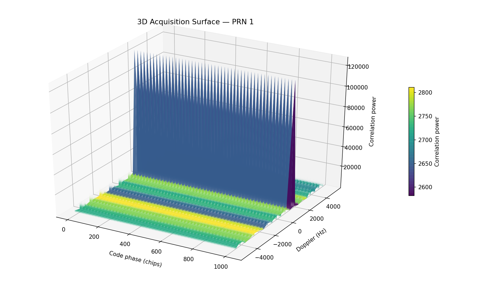
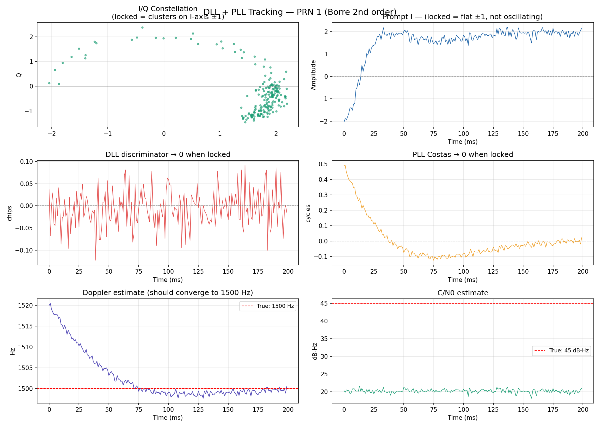
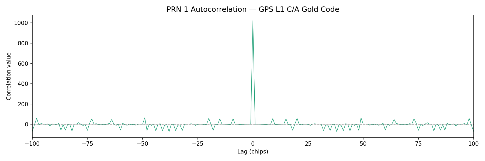
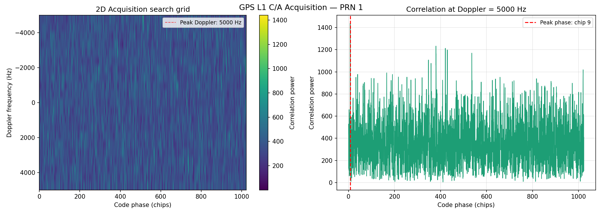
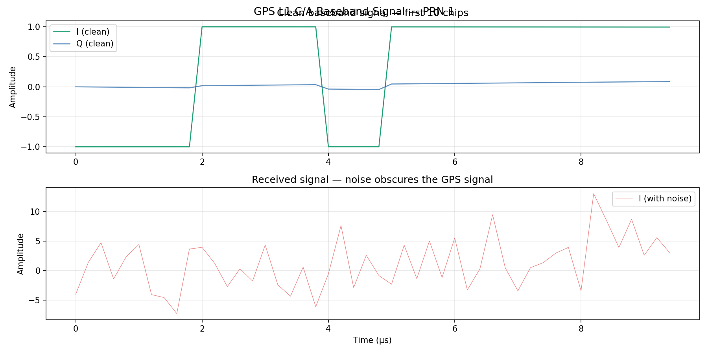

# GPS L1 C/A Software Receiver


A GPS L1 C/A software receiver built from scratch in Python — no GNSS
libraries, no black boxes. Every component implements the signal processing
chain as specified in **IS-GPS-200**.

Built as part of my transition from aerospace structural engineering into
GNSS signal processing, alongside the **JSNP Industrial Master at GNSS Academy**.

---

## Acquisition result — PRN 1 detected at Doppler +1500 Hz



*The sharp yellow peak rising from the noise floor is the GPS satellite signal
being detected. X-axis: code phase (chips). Y-axis: Doppler frequency (Hz).
Z-axis: correlation power. This is what a GPS receiver does before it can
compute any position.*

---

## Receiver architecture
Raw signal (complex baseband)
│
▼
┌───────────────────┐
│  PRN Generator    │  Gold codes for all 32 GPS SVs (IS-GPS-200 Table 3-Ia)
│  prn_generator.py │  1023-chip sequences, autocorrelation peak = 1023
└────────┬──────────┘
│
▼
┌───────────────────┐
│ Signal Simulator  │  Complex baseband: PRN × exp(j·2π·Doppler·t) + AWGN
│signal_simulator.py│  C/N0 = 45 dB-Hz | fs = 5 MHz | duration = 200 ms
└────────┬──────────┘
│
▼
┌───────────────────┐
│   Acquisition     │  FFT-based parallel code-phase search
│  acquisition.py   │  Doppler search: ±5000 Hz, 500 Hz steps
└────────┬──────────┘  Detection threshold: peak/mean > 2.5  (PRN 1 achieved 236)
│
▼
┌───────────────────┐
│  DLL + PLL        │  Borre 2nd-order loop filters
│   tracking.py     │  DLL: 1 Hz BW — code phase tracking
└───────────────────┘  PLL: 15 Hz BW — Costas loop carrier tracking
---

## Tracking results — PRN 1



| Metric | Result | Target |
|---|---|---|
| Final Doppler error | **0.62 Hz** | < 5 Hz |
| DLL error (last 20ms) | **0.04 chips** | < 0.1 chips |
| Epochs processed | **200** | 200 |
| PLL convergence | **Yes** | — |

---

## Key results summary

| Component | Output | Validation |
|---|---|---|
| PRN generator | 1023-chip Gold codes, all 32 SVs | Peak = 1023, sidelobe ≤ 78 ✅ |
| Signal simulator | Complex baseband, 200 ms | 1,000,000 samples at 5 MHz ✅ |
| Acquisition | PRN 1 detected at +1500 Hz Doppler | Peak/mean ratio = 236 ✅ |
| DLL tracking | Code phase locked | 0.04 chip residual error ✅ |
| PLL tracking | Carrier locked | 0.62 Hz Doppler error ✅ |

---

## Signal processing plots

### PRN autocorrelation


*Sharp peak at zero lag = 1023. Near-zero sidelobes everywhere else.
This property is what allows a GPS receiver to detect a signal
20 dB below the noise floor.*

### 2D acquisition search grid


*Left: correlation power across all code phases and Doppler bins.
Right: 1D slice at the detected Doppler — sharp correlation peak
at the correct code phase.*

### Baseband signal (time domain)


*Top: clean baseband signal — PRN code modulated with Doppler shift.
Bottom: received signal with AWGN noise (C/N0 = 45 dB-Hz).
The GPS signal is completely invisible in noise — acquisition finds it anyway.*

---

## Repository structure
gps-software-receiver/
├── prn_generator.py       PRN Gold code generator (IS-GPS-200 compliant)
├── signal_simulator.py    Complex baseband GPS signal simulator
├── acquisition.py         FFT-based parallel acquisition engine
├── tracking.py            DLL + PLL tracking loops (Borre formulation)
├── results/               Output figures
│   ├── prn1_acquisition_3d.png
│   ├── prn1_acquisition.png
│   ├── prn1_tracking.png
│   ├── prn_1_autocorrelation.png
│   └── prn1_signal_timedomain.png
└── .gitignore
---

## How to run

```bash
# Clone
git clone https://github.com/NedalAmsi/gps-software-receiver.git
cd gps-software-receiver

# Install dependencies
pip install numpy matplotlib

# Run the full chain in order
python prn_generator.py       # Generate and verify PRN codes
python signal_simulator.py    # Simulate GPS baseband signal
python acquisition.py         # Acquire signal — find Doppler + code phase
python tracking.py            # Track — lock DLL and PLL
```

---

## Technical references

- **IS-GPS-200** — GPS Interface Specification (signal structure, PRN codes)
- **Borre et al.** — *A Software-Defined GPS and Galileo Receiver* (loop filter design)
- **Kaplan & Hegarty** — *Understanding GPS/GNSS: Principles and Applications*

---

## Work in progress

- [ ] RINEX observation file parser (real IGS data)
- [ ] Pseudorange least-squares position solver
- [ ] Ionospheric correction (Klobuchar model)
- [ ] Multi-satellite acquisition (4+ SVs simultaneously)
- [ ] GNSS/INS loosely-coupled Extended Kalman Filter

---

## About

**Nedal Amsi** — Aerospace Engineer transitioning into GNSS Signal Processing

- 🎓 MSc Aerospace Engineering — University Internationale de Rabat (UIR)
- 📡 JSNP Industrial Master — GNSS Academy (in progress)
- 🌕 Contributed to a lunar habitat mission with MISI Morocco
- 🔭 Targeting junior GNSS Signal Processing Engineer roles in Europe

[](https://www.linkedin.com/in/nedalamsi)
[](https://github.com/NedalAmsi)
